# Mermaid Complete Cheatsheet

> Recommended for Obsidian with Mermaid Next.  
> Copy the diagram you need and edit the content.

---

## 1. Flowchart

Use for workflows, algorithms, and processes.

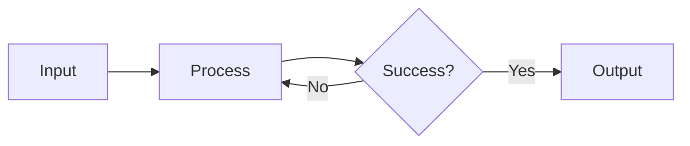

---

## 2. Swimlane Diagram

Use for workflows where responsibility matters.

```mermaid-next
swimlane-beta LR

    subgraph User
        A[Submit Request]
    end

    subgraph System
        B[Validate]
        C[Process]
    end

    subgraph Admin
        D[Approve]
    end

    A --> B
    B --> C
    C --> D
```

---

## 3. Sequence Diagram

Use for APIs, service calls, and system interactions.

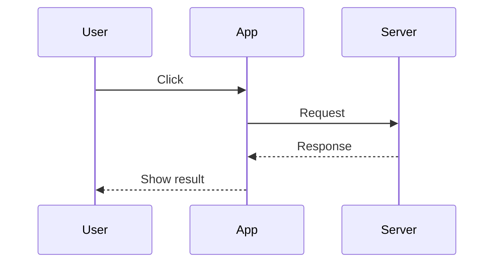

---

## 4. Class Diagram

Use for software architecture and object-oriented models.

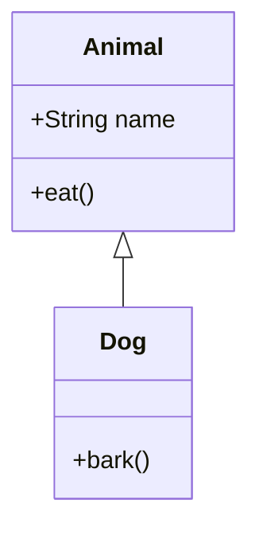

---

## 5. State Diagram

Use for state machines and lifecycle transitions.

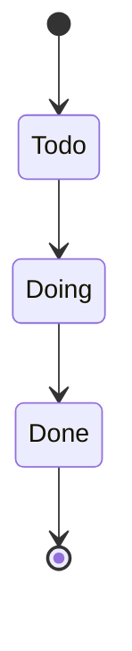

---

## 6. Entity Relationship Diagram

Use for database models.

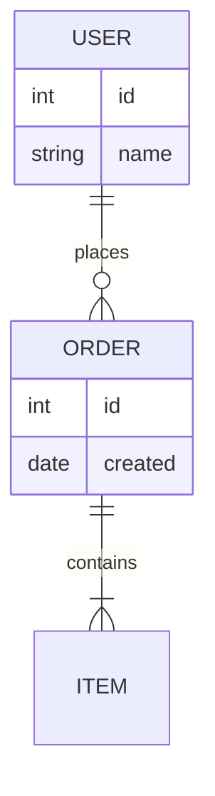

---

## 7. User Journey

Use for product and user-experience flows.

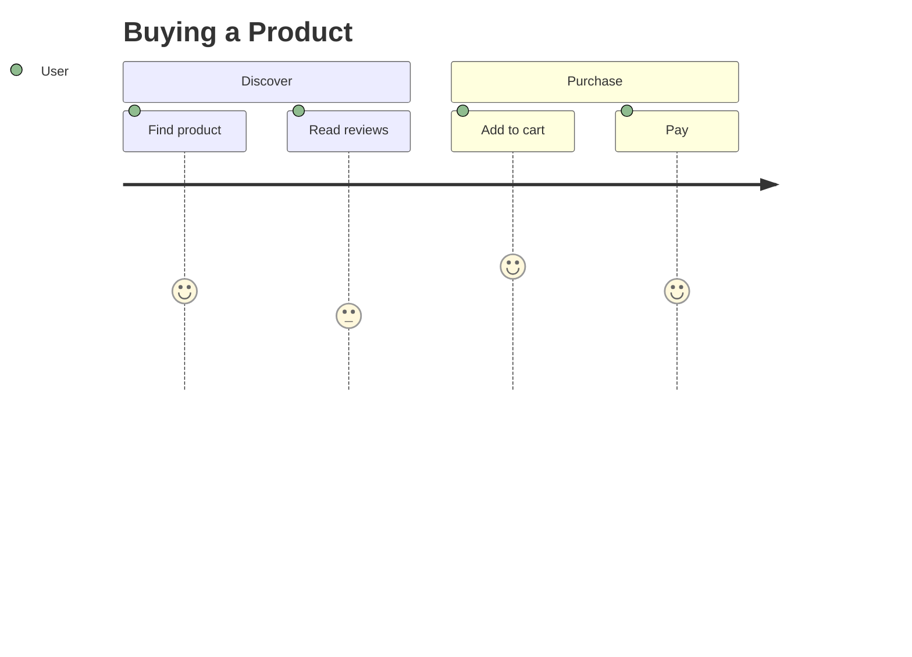

---

## 8. Gantt Chart

Use for project planning and schedules.

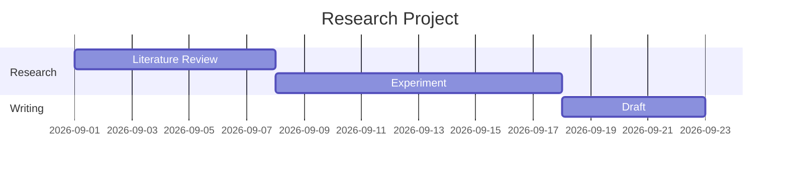

---

## 9. Pie Chart

Use for proportions.

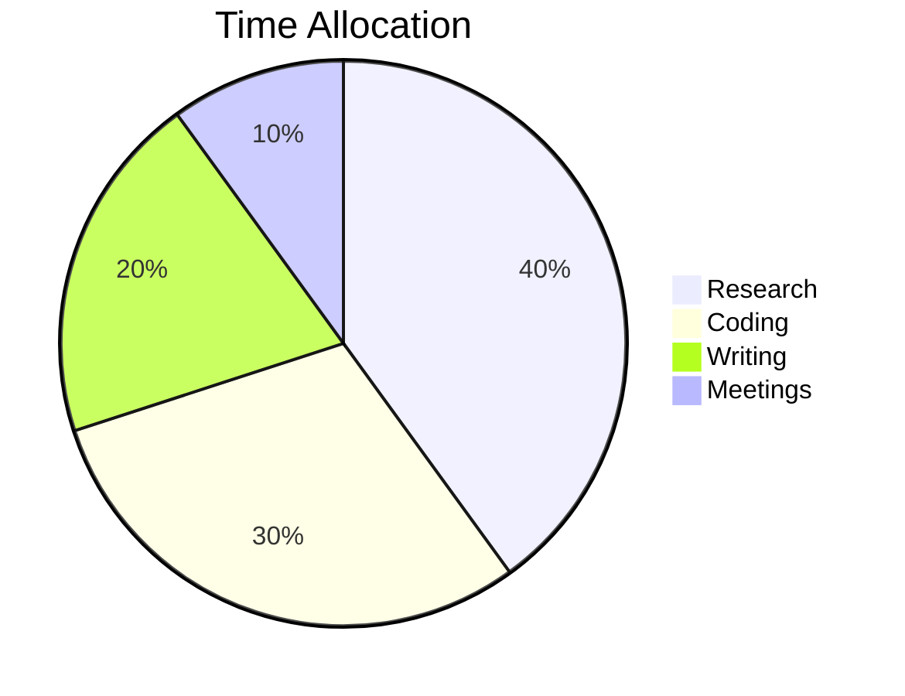

---

## 10. Quadrant Chart

Use for prioritization and competitive positioning.

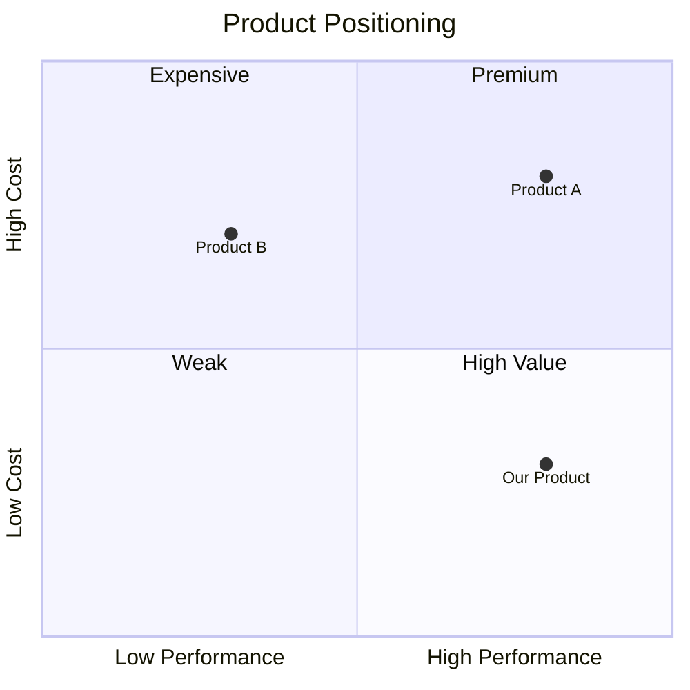

---

## 11. Requirement Diagram

Use for system requirements and SysML-style modeling.

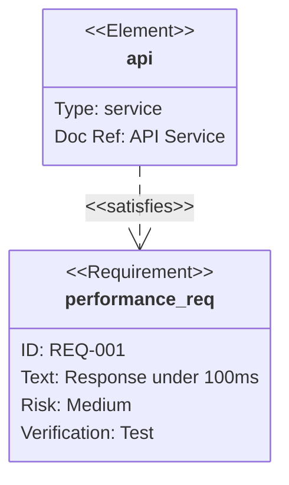


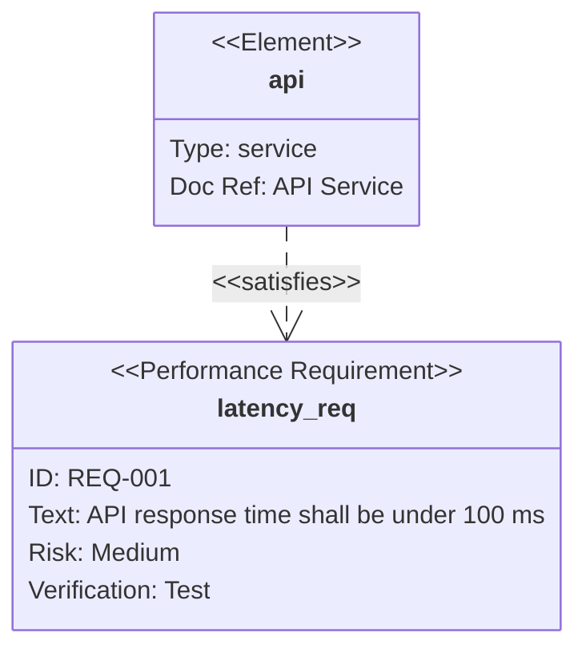

---

## 12. Use Case Diagram

Use for actors and system capabilities.

```mermaid-next
usecase-beta
    direction LR

    actor User

    Login("Log in")
    Search("Search")
    Purchase("Purchase")

    User --> Login
    User --> Search
    User --> Purchase
```

---

## 13. Git Graph

Use for branches and merges.

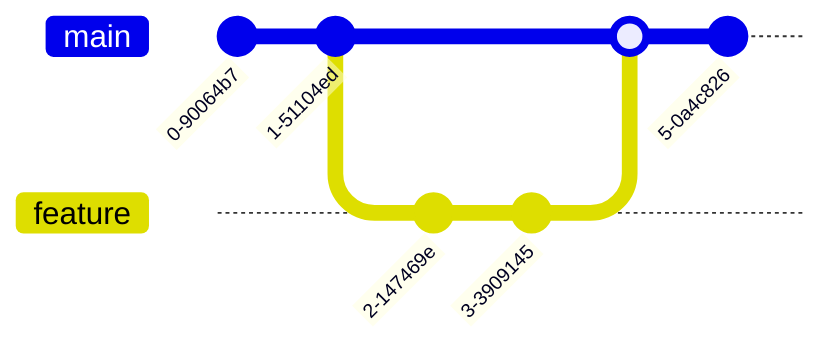

---

## 14. C4 Diagram

Use for high-level software architecture.

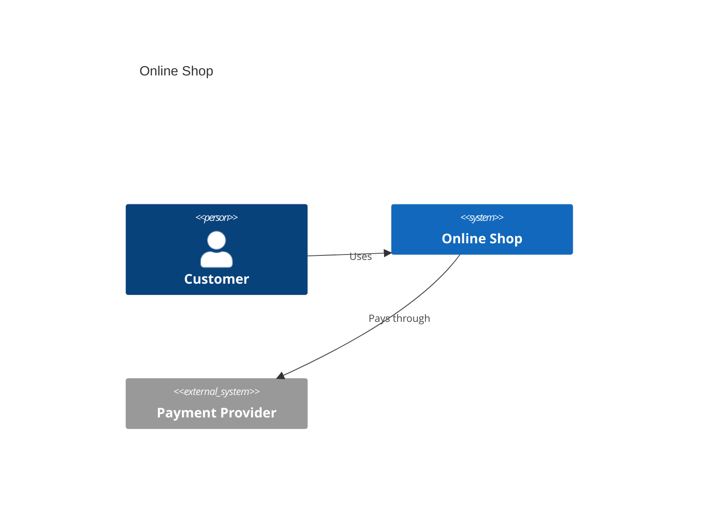

---

## 15. Mindmap

Use for topics, learning maps, and knowledge structures.

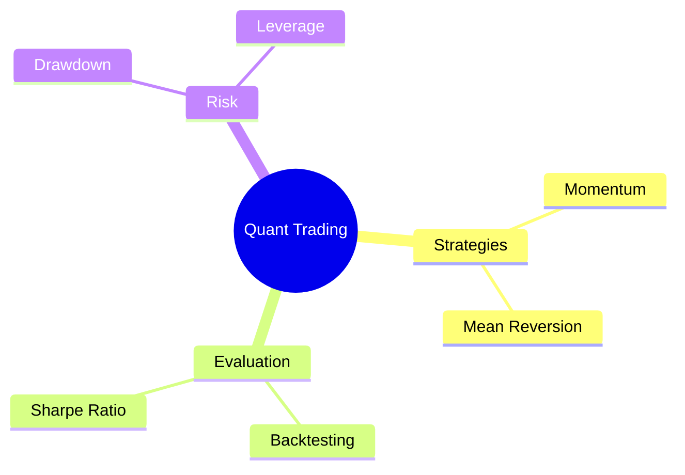

---

## 16. Timeline

Use for history, milestones, and evolution.

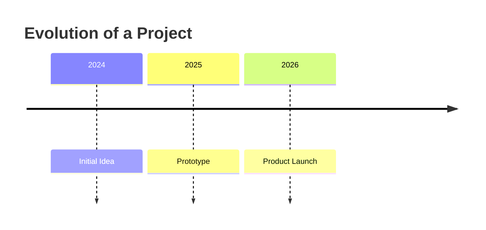

---

## 17. Sankey Diagram

Use for flows of money, energy, traffic, or users.

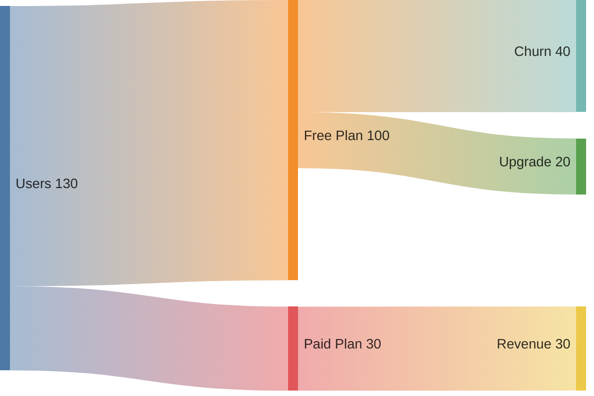

Format:

```text
Source,Target,Value
```

---

## 18. Tree View

Use for file trees and hierarchical structures.


---

## 19. XY Chart

Use for benchmarks, line charts, and bar charts.

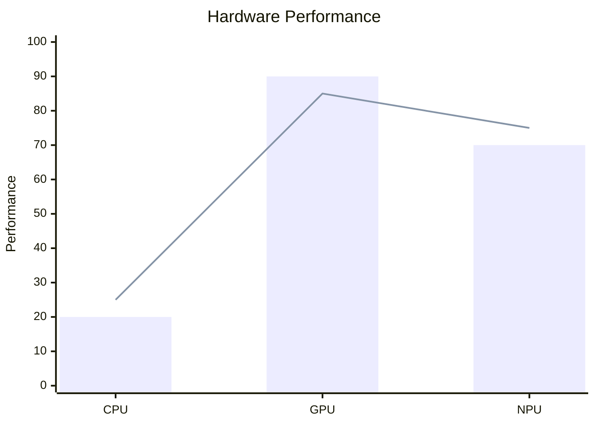

---

## 20. Block Diagram

Use for system modules and component layouts.

```mermaid-next
block-beta

    columns 3

    A["Input"]
    B["AI Optimizer"]
    C["Hardware"]

    A --> B
    B --> C
```

---

## 21. Packet Diagram

Use for network protocols and bit fields.

```mermaid-next
packet

    0-15: "Source Port"
    16-31: "Destination Port"
    32-47: "Length"
    48-63: "Checksum"
```

---

## 22. Kanban

Use for simple task boards.

```mermaid-next
kanban
    todo[Todo]
        task1[Read Paper]
        task2[Run Experiment]

    doing[Doing]
        task3[Write Code]

    done[Done]
        task4[Setup Obsidian]
```

---

## 23. Architecture Diagram

Use for cloud, infrastructure, and service architecture.

```mermaid-next
architecture-beta

    group api(cloud)[API]

    service db(database)[Database] in api
    service server(server)[Server] in api
    service storage(disk)[Storage] in api

    db:L -- R:server
    storage:T -- B:server
```

---

## 24. Radar Diagram

Use for multidimensional comparison.

```mermaid-next
radar-beta

    title Team Skills

    axis Coding, Research, Writing, Product, Sales

    curve Alice{9,8,6,5,3}
    curve Bob{6,5,8,8,7}
```

---

## 25. Event Modeling

Use for event-driven systems and DDD.

```mermaid-next
eventmodeling

    tf 01 ui CartUI
    tf 02 cmd AddItem
    tf 03 evt ItemAdded
    tf 04 rmo CartItems
```

Common entities:

```text
ui   = User Interface
cmd  = Command
evt  = Event
rmo  = Read Model
pcr  = Processor
```

---

## 26. Treemap

Use for hierarchical proportions.

```mermaid-next
treemap-beta

    "Revenue"
        "Product A": 50
        "Product B": 30

    "Services"
        "Consulting": 15
        "Support": 5
```

---

## 27. Venn Diagram

Use for set relationships.

```mermaid-next
venn-beta

    title Good Startup Idea

    set Desirable
    set Feasible
    set Viable

    union Desirable,Feasible["Can build"]

    union Feasible,Viable["Can sustain"]

    union Desirable,Feasible,Viable["Build this"]
```

---

## 28. Ishikawa Diagram

Also called a fishbone or cause-and-effect diagram.

Use for root cause analysis.

```mermaid-next
ishikawa-beta
    Slow AI Inference

    Hardware
        Memory bandwidth
        Low GPU utilization

    Software
        Poor kernel
        Excessive synchronization

    Model
        Large context
        Large batch

    Infrastructure
        Network latency
        Storage bottleneck
```

---

## 29. Wardley Map

Use for strategy, technology evolution, and build-vs-buy thinking.

```mermaid-next
wardley-beta

    title AI Infrastructure

    anchor User [0.95, 0.10]

    component AI Product [0.80, 0.30]
    component Inference Engine [0.60, 0.45]
    component GPU [0.40, 0.80]

    User -> AI Product
    AI Product -> Inference Engine
    Inference Engine -> GPU
```

Coordinates:

```text
[Visibility, Evolution]
```

---

## 30. Cynefin Diagram

Use for classifying problems by complexity.

```mermaid-next
cynefin-beta

    title Project Problems

    complex
        "New product discovery"

    complicated
        "GPU performance tuning"

    clear
        "Deploy documentation"

    chaotic
        "Production outage"

    confusion
        "Unknown customer problem"
```

---

# Quick Selection Guide

| What you want to show             | Mermaid type         |
| --------------------------------- | -------------------- |
| Workflow                          | `flowchart`          |
| Responsibility across steps       | `swimlane-beta`      |
| API/system calls                  | `sequenceDiagram`    |
| Object/class relationships        | `classDiagram`       |
| State transitions                 | `stateDiagram-v2`    |
| Database model                    | `erDiagram`          |
| User experience                   | `journey`            |
| Project schedule                  | `gantt`              |
| Proportions                       | `pie`                |
| Competitive positioning           | `quadrantChart`      |
| System requirements               | `requirementDiagram` |
| Actors and system functions       | `usecase-beta`       |
| Git branching                     | `gitGraph`           |
| Software architecture             | `C4Context`          |
| Knowledge structure               | `mindmap`            |
| Historical events                 | `timeline`           |
| Code-like sequence                | `zenuml`             |
| Flow of money/users/energy        | `sankey`             |
| Benchmarks                        | `xychart`            |
| System modules                    | `block-beta`         |
| Network packet structure          | `packet`             |
| Task board                        | `kanban`             |
| Cloud/infrastructure architecture | `architecture-beta`  |
| Multidimensional comparison       | `radar-beta`         |
| Event-driven systems              | `eventmodeling`      |
| Hierarchical proportions          | `treemap-beta`       |
| Set relationships                 | `venn-beta`          |
| Root cause analysis               | `ishikawa-beta`      |
| Strategy mapping                  | `wardley-beta`       |
| Problem complexity                | `cynefin-beta`       |
| File/folder hierarchy             | `treeView-beta`      |

---

# The 8 Most Useful Ones

```text
flowchart
sequenceDiagram
mindmap
timeline
gantt
xychart
quadrantChart
architecture-beta
```

---

# Universal Fallback

When in doubt, start with:

```mermaid-next
flowchart LR
    A[Input]
    B[Process]
    C[Output]

    A --> B --> C
```