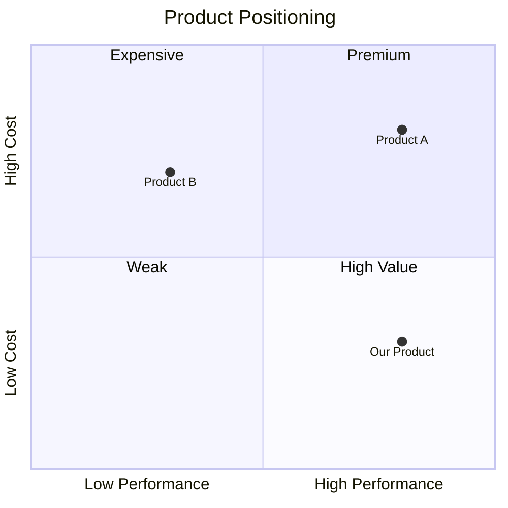

```mermaid-next
quadrantChart
    title Product Positioning

    x-axis Low Performance --> High Performance
    y-axis Low Cost --> High Cost

    quadrant-1 Premium
    quadrant-2 Expensive
    quadrant-3 Weak
    quadrant-4 High Value

    Product A: [0.8, 0.8]
    Product B: [0.3, 0.7]
    Our Product: [0.8, 0.3]
```
