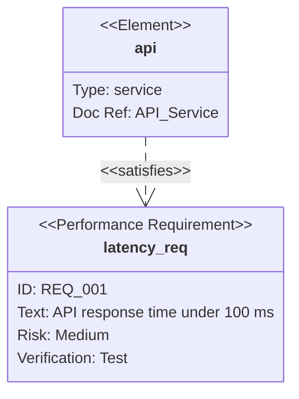

```mermaid-next
requirementDiagram
    performanceRequirement latency_req {
        id: REQ_001
        text: API response time under 100 ms
        risk: Medium
        verifymethod: Test
    }

    element api {
        type: service
        docref: API_Service
    }

    api - satisfies -> latency_req
```
